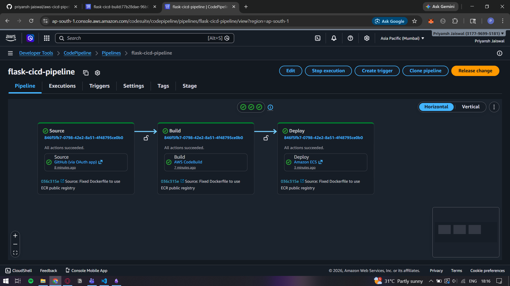
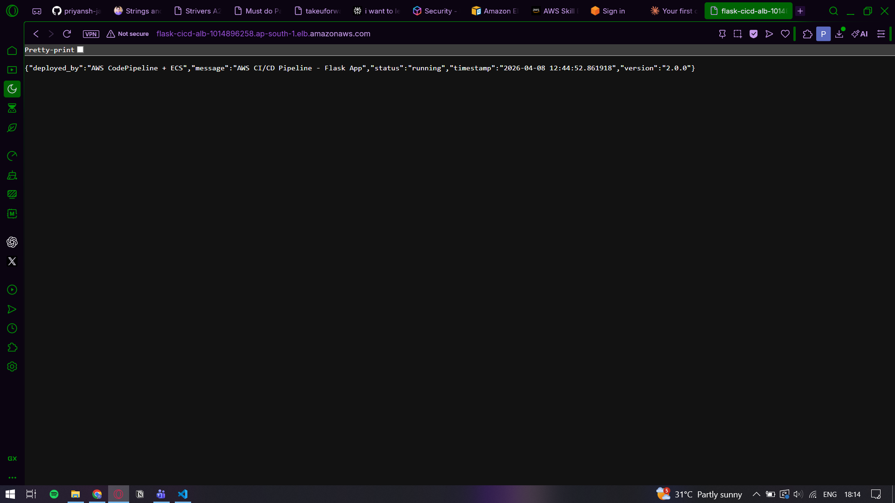
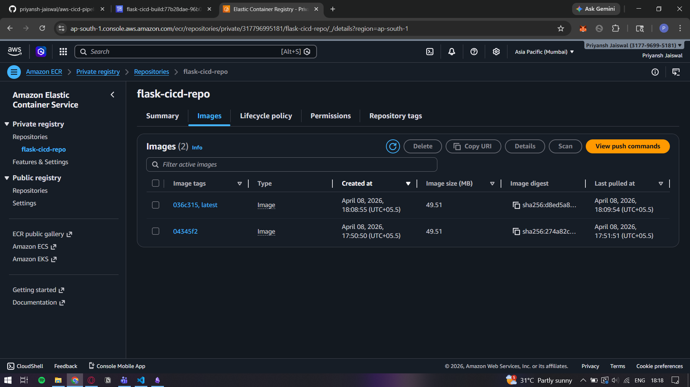
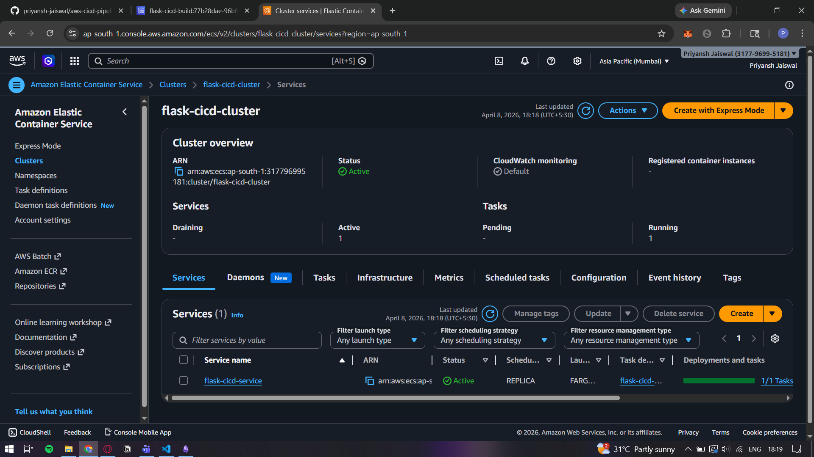
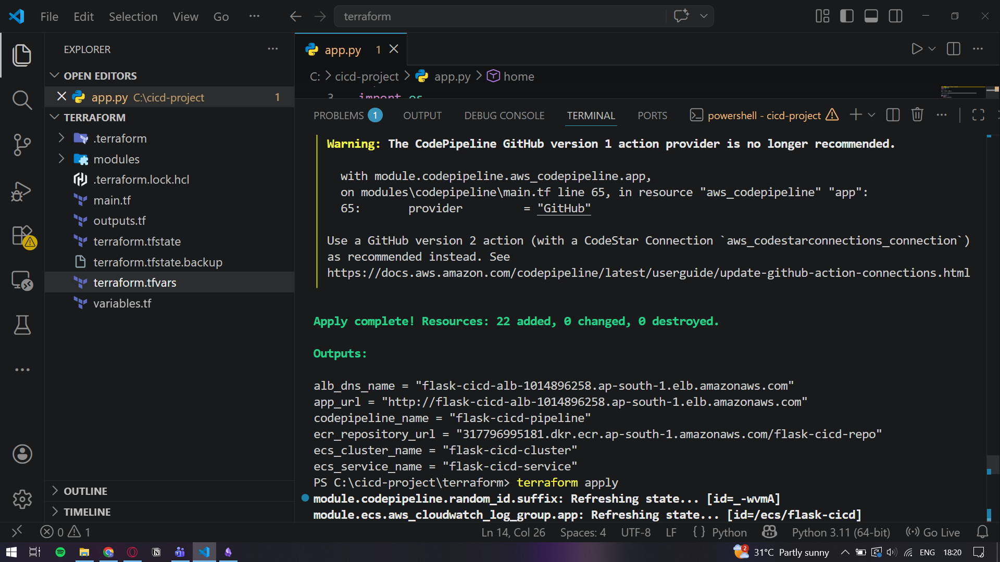

# AWS CI/CD Pipeline with Terraform — Flask + Docker + ECS

A fully automated CI/CD pipeline deployed on AWS using Terraform (Infrastructure as Code). Every code push to GitHub automatically builds a Docker image, pushes it to ECR, and deploys it to ECS Fargate.

## Live Demo
App URL: http://flask-cicd-alb-1014896258.ap-south-1.elb.amazonaws.com

## Architecture
Code Push → GitHub → CodePipeline → CodeBuild → ECR (Docker Image) → ECS Fargate → ALB → Live App

## Tech Stack
- **IaC:** Terraform
- **App:** Python Flask + Gunicorn
- **Containerization:** Docker
- **Container Registry:** Amazon ECR
- **Container Runtime:** Amazon ECS (Fargate)
- **CI/CD:** AWS CodePipeline + CodeBuild
- **Load Balancer:** Application Load Balancer
- **Permissions:** AWS IAM

## Project Structure

```
cicd-project/
├── app.py                  ← Flask application
├── requirements.txt        ← Python dependencies
├── Dockerfile              ← Container configuration
├── buildspec.yml           ← CodeBuild instructions
└── terraform/
    ├── main.tf
    ├── variables.tf
    ├── outputs.tf
    ├── terraform.tfvars
    └── modules/
        ├── ecr/            ← Container registry
        ├── iam/            ← IAM roles
        ├── alb/            ← Load balancer
        ├── ecs/            ← Container runtime
        └── codepipeline/   ← CI/CD pipeline
```
## How the Pipeline Works
1. Developer pushes code to GitHub
2. CodePipeline detects the push automatically via webhook
3. CodeBuild pulls the code and builds a Docker image
4. Docker image is pushed to Amazon ECR
5. CodePipeline tells ECS to deploy the new image
6. ECS pulls the new image and updates the running container
7. App is live and updated with zero downtime

## API Endpoints
| Endpoint | Description |
|----------|-------------|
| `/` | App status and version |
| `/health` | Health check for ALB |
| `/info` | App info and environment |

## How to Deploy

### Prerequisites
- AWS CLI configured
- Terraform installed
- Docker installed
- GitHub personal access token

### Steps
```bash
# Clone the repo
git clone https://github.com/priyansh-jaiswal/aws-cicd-pipeline-terraform

# Update terraform.tfvars with your values
# vpc_id, subnet_ids, github_token, aws_account_id

# Initialize Terraform
cd terraform
terraform init

# Preview resources
terraform plan

# Deploy everything
terraform apply
```

### Destroy
```bash
terraform destroy
```

## Screenshots

### CodePipeline — All 3 Stages


### Flask App Live on AWS


### ECR — Docker Images


### ECS — Cluster Running


### Terraform Apply Output


## Key Concepts Demonstrated
- Infrastructure as Code with Terraform
- Containerization with Docker
- Serverless containers with ECS Fargate
- Automated CI/CD with CodePipeline
- Private Docker registry with ECR
- Load balancing with ALB
- Least privilege IAM roles

## Author
Priyansh Jaiswal
[GitHub](https://github.com/priyansh-jaiswal)
